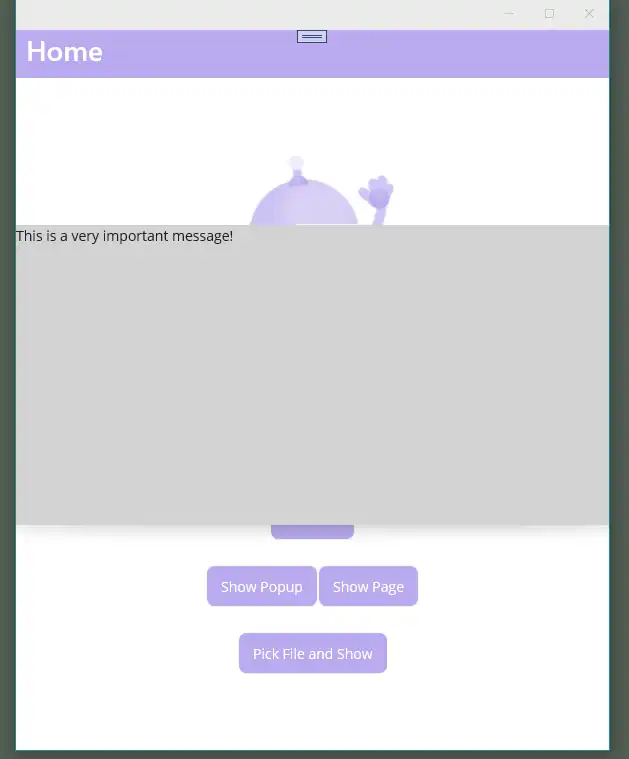

# dotnet-maui-readiness - PHASE1

## References

  - ms-dotnet-first-app
      - Instructions as per 
        [Microsoft dotnet maui first-app](https://docs.microsoft.com/en-us/dotnet/maui/get-started/first-app?pivots=devices-windows).

<hr/>

## Environment

  - Windows 10
  - Visual Studio 2022 Preview for Windows
     - 17.3.0 Preview 5

## Making the first-app

  - From VS2022 New Template
      - .NET MAUI App
      - Project Name *NetMauiReadiness*
      - Framework .NET 6.0 (Long-term support)

## Nuget packages (part 1)

  - Prism.Core
  - Prism.Maui
  - Prism.DryIoc.Maui
  - CommunityToolkit.MVVM
      - By Microsoft; for stuff like AsyncRelayCommand...
  - CommunityTookit.MAUI
      - For Popup support.

<hr/>

## Feature progress

### Added MainPageViewModel etc...

  - Added ViewModelBase(.cs)
  - Added MainViewModel(.cs) derived from ViewModelBase.
  - Made MainPage's view-model MainViewModel.

### ShowPopup

Use CommunityToolkit.MAUI. Don't forget

```cs
builder.UseMauiCommunityToolkit() ...
```   
then to display use
```cs
App.Current?.MainPage?.ShowPopup(popup);
```

#### ShowPopup on Windows



### ShowPage

```cs
await App.Current.MainPage.Navigation?.PushAsync(new SomePage())
```

### FilePicker

  - See [.NET MAUI > FilePicker](https://docs.microsoft.com/en-us/dotnet/maui/platform-integration/storage/file-picker?tabs=windows)
  - IOS/Android permissions needed
      - Android/MainApplication.cs - [assembly: UsesPermission(Android.Manifest.Permission.ReadExternalStorage)]
      - IOS - ?? Enable iCloud capabilities ??

```cs
await FilePicker.Default.PickAsync(options)
```
