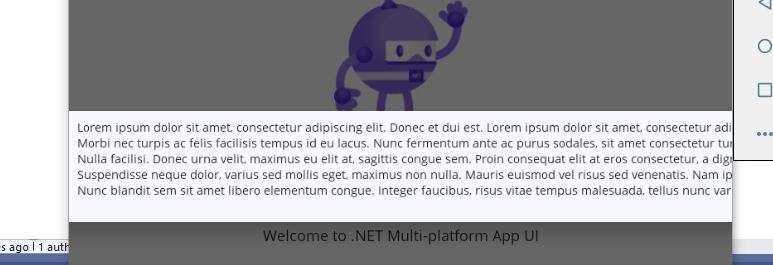

# dotnet-maui-readiness - RESULTS - PHASE1

Here we show how the various features work across the plaforms:

<table>
<tbody>
<!-- U+2713 is a Tick mark -->
<tr>
  <td width="30%">Features</td>
  <td>Windows</td>
  <td>MacCatalyst (MacOS)</td>
  <td>IOS simulator</td>
  <td>Android simulator</td>
</tr>
<tr>
    <td>Button Click Counter</td>
    <td>&#x2713;</td>
    <td>&#x2713;</td>
    <td>&#x2713;</td>
    <td>&#x2713;</td>
</tr>
<tr>
    <td>Nav > Popup</td>
    <td>&#x2713;</td>
    <td>&#x2713;</td>
    <td>&#x2713;</td>
    <td>Popup is too wide in Android - no text wrap.</td>
</tr>
<tr>
    <td>Nav > Page</td>
    <td>&#x2713;</td>
    <td>&#x2713;</td>
    <td>&#x2713;</td>
    <td>&#x2713;</td>
</tr>
<tr>
    <td>File Picker</td>
    <td>&#x2713;</td>
    <td>&#x2713; - see Notes 2.</td>
    <td>&#x2713;</td>
    <td>&#x2713;</td>
</tr>
</tbody>
</table>

## Notes

  1. Nav > Popup - Android - text doesn't wrap.  
     
  2. This failed initially due to Entitlements.plist > sandbox=true settings.
